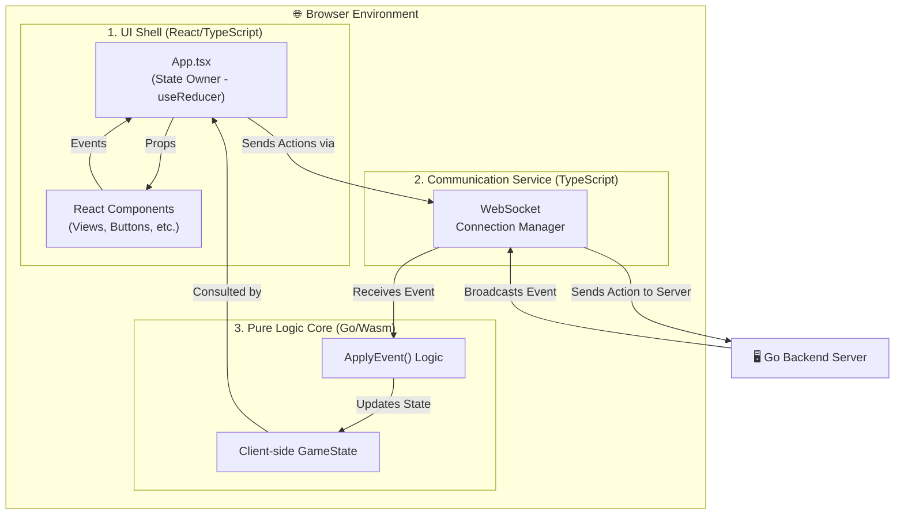
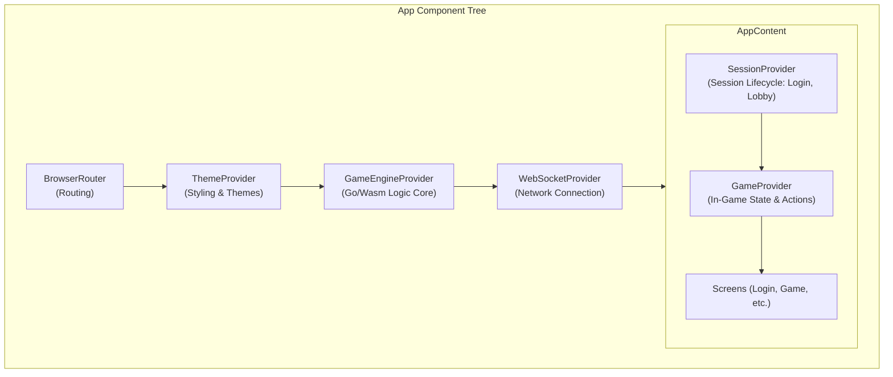

# Frontend Client Architecture

This directory contains the source code for the `Alignment` web client, a hybrid application built with Go/WebAssembly and React/TypeScript.

## Technology Stack

*   **UI Framework:** [React](https://react.dev/) with [TypeScript](https://www.typescriptlang.org/) for type-safe component development.
*   **Game Engine:** A core game logic module written in **Go** and compiled to **WebAssembly** (`.wasm`). This module is located in `/client/wasm`.
*   **Build Tool:** [Vite](https://vitejs.dev/) for fast development builds and optimized production bundling.
*   **Styling:** [Tailwind CSS](https://tailwindcss.com/) integrated with design tokens for consistent theming and responsive design.

---

## Architectural Pattern: A Three-Layer Model

The client is designed with a clear separation of concerns to ensure robustness and maintainability.


```mermaid
graph TD
    subgraph Browser["🌐 Browser Environment"]
        subgraph ReactShell["1. UI Shell (React/TypeScript)"]
            direction TB
            AppState["App.tsx<br/>(State Owner - useReducer)"]
            Components["React Components<br/>(Views, Buttons, etc.)"]
            AppState -->|Props| Components
            Components -->|Events| AppState
        end

        subgraph CommsService["2. Communication Service (TypeScript)"]
            direction TB
            WebSocket["WebSocket<br/>Connection Manager"]
        end

        subgraph WasmCore["3. Pure Logic Core (Go/Wasm)"]
            direction TB
            GameState["Client-side GameState"]
            ApplyEvent["ApplyEvent() Logic"]
        end
    end

    Server["🖥️ Go Backend Server"]

    %% Data Flow
    AppState -- "Sends Actions via" --> WebSocket
    WebSocket -- "Sends Action to Server" --> Server
    Server -- "Broadcasts Event" --> WebSocket
    WebSocket -- "Receives Event" --> ApplyEvent
    ApplyEvent -- "Updates State" --> GameState
    GameState -- "Consulted by" --> AppState
```

1.  **The "UI Shell" (React/TypeScript):** The presentation and state management layer.
    *   `App.tsx` is the state owner, using `useReducer` to manage all application state centrally.
    *   It captures user input (clicks, typing) and sends actions via the Communication Service.
    *   It receives events from the server and updates its own state accordingly.
    *   Child components receive state as props and communicate back through event handlers.

2.  **The "Communication Service" (TypeScript):** The network layer.
    *   The service at `src/services/websocket.ts` manages the WebSocket connection, including connection, disconnection, and automatic reconnection logic.
    *   It receives raw events from the server and forwards them to both the Pure Logic Core and UI event handlers.

3.  **The "Pure Logic Core" (Go/Wasm):** The game rules validation layer.
    *   It holds the authoritative client-side copy of the `core.GameState`.
    *   It contains the shared `ApplyEvent` function (from `/core`) to process events and maintain consistent game state.
    *   App.tsx consults this core through `useGameEngineContext()` to get validated game state for UI updates.
    *   It does **not** manage UI state or network connections directly.

## React Context Architecture: Decoupling State Management

To manage global state cleanly and prevent prop-drilling, we use a layered system of React Contexts. Each provider has a distinct responsibility, allowing for a clear separation of concerns.


```mermaid
graph TD
    subgraph "App Component Tree"
        BrowserRouter["BrowserRouter<br>(Routing)"] --> ThemeProvider
        ThemeProvider["ThemeProvider<br>(Styling & Themes)"] --> GameEngineProvider
        GameEngineProvider["GameEngineProvider<br>(Go/Wasm Logic Core)"] --> WebSocketProvider
        WebSocketProvider["WebSocketProvider<br>(Network Connection)"] --> AppContent["AppContent<br>(Main Application Logic)"]

        subgraph AppContent
            SessionProvider["SessionProvider<br>(Session Lifecycle: Login, Lobby)"] --> GameProvider
            GameProvider["GameProvider<br>(In-Game State & Actions)"] --> Screens["Screens (Login, Game, etc.)"]
        end
    end
```

*   **`ThemeProvider`**: Manages the application's visual theme (e.g., light/dark mode) and provides theming utilities to all components.
*   **`GameEngineProvider`**: Manages the Go/WebAssembly module. It handles loading the `.wasm` file, exposes the core game logic functions, and holds the authoritative client-side `GameState`.
*   **`WebSocketProvider`**: Manages the raw WebSocket network connection, including connection, disconnection, and reconnection logic. It provides a simple `sendAction` function and an event subscription system.
*   **`SessionProvider`**: Manages the overall user session lifecycle. It handles state transitions between being logged out, in a lobby, and in a game. It is the source of truth for the player's identity and credentials.
*   **`GameProvider`**: Provides focused, contextual access to the *current* game state for components *within* an active game. This simplifies in-game components by giving them direct access to the `localPlayer`, the `viewedPlayer`, and game-specific actions.

## State Management: Centralized in `App.tsx`

To prevent race conditions and ensure a predictable data flow, we use a **centralized state management** pattern where we "lift state up."

*   **`App.tsx` is the Session Manager:** The root `App` component is the single source of truth for the application's session state.
*   **Centralized Event Handling:** `App.tsx` is the primary listener for all critical, session-wide WebSocket events (e.g., `LOBBY_STATE_UPDATE`, `GAME_STARTED`, `ROLE_ASSIGNED`).
*   **One-Way Data Flow:**
    1.  `App.tsx` receives a WebSocket event.
    2.  It updates its own React state (e.g., `setLobbyState`, `setRoleAssignment`).
    3.  This new state is passed down to the currently visible screen component (e.g., `WaitingScreen`, `RoleRevealScreen`) as props.
    4.  The child component re-renders with the new data.

This pattern is inherently more robust than having individual components listen for events, as `App.tsx` is always mounted and can never miss an event. It guarantees that data is ready *before* a component that needs it is rendered.

---

## Development

To run the client in development mode:

```bash
npm run dev
```

This will start the Vite dev server, which proxies API and WebSocket requests to the backend server (expected to be running on `localhost:8080`).
