# Frontend Client Architecture

This directory contains the source code for the `Alignment` web client, a hybrid application built with Go/WebAssembly and React/TypeScript.

## Technology Stack

*   **UI Framework:** [React](https://react.dev/) with [TypeScript](https://www.typescriptlang.org/) for type-safe component development.
*   **Game Engine:** A core game logic module written in **Go** and compiled to **WebAssembly** (`.wasm`). This module is located in `/client/wasm`.
*   **Build Tool:** [Vite](https://vitejs.dev/) for fast development builds and optimized production bundling.
*   **Styling:** Plain CSS with variables, following the visual design specified in `/design`.

---

## Architectural Pattern: A Three-Layer Model

The client is designed with a clear separation of concerns to ensure robustness and maintainability.

```mermaid
graph TD
    subgraph Browser["🌐 Browser Environment"]
        subgraph ReactShell["1. UI Shell (React/TypeScript)"]
            direction TB
            Components["React Components<br/>(Views, Buttons, etc.)"] -->|Triggers| UserActions["User Actions (onClick, etc.)"]
        end

        subgraph CommsService["2. Communication Service (TypeScript)"]
            direction TB
            WebSocket["WebSocket<br/>Connection Manager"]
        end

        subgraph WasmEngine["3. Engine (Go/Wasm)"]
            direction TB
            GameState["Client-side GameState"]
            ApplyEvent["ApplyEvent() Logic"]
        end
    end

    Server["🖥️ Go Backend Server"]

    %% Data Flow
    UserActions -- "Calls function on Service" --> WebSocket
    WebSocket -- "Sends Action to Server" --> Server
    Server -- "Broadcasts Event" --> WebSocket
    WebSocket -- "Receives Event" --> ApplyEvent
    ApplyEvent -- "Updates State" --> GameState
    GameState -- "Provides data to" --> Components
```



1.  **The "UI Shell" (React/TypeScript):** The presentation layer.
    *   Its primary job is to render UI components based on the state it receives.
    *   It captures user input (clicks, typing) and calls functions on the Communication Service to send actions to the server.
    *   It does **not** contain any game rule or direct WebSocket logic.

2.  **The "Communication Service" (TypeScript):** The network layer.
    *   The service at `src/services/websocket.ts` is responsible for managing the WebSocket connection, including connection, disconnection, and automatic reconnection logic.
    *   It receives raw events from the server and forwards them to the Go/Wasm Engine for processing.

3.  **The "Engine" (Go/Wasm):** The core logic layer.
    *   It holds the local, client-side copy of the `core.GameState`.
    *   It contains the shared `ApplyEvent` function (from `/core`) to process events received from the Communication Service and update its state.
    *   It exposes a small, well-defined API to the JavaScript world (e.g., `getGameState()`, `applyEvent()`). It does **not** manage the network connection directly.

### State Management: Centralized in `App.tsx`

To prevent race conditions and ensure a predictable data flow, we use a **centralized state management** pattern where we "lift state up."

*   **`App.tsx` is the Session Manager:** The root `App` component is the single source of truth for the application's session state.
*   **Centralized Event Handling:** `App.tsx` is the primary listener for all critical, session-wide WebSocket events (e.g., `LOBBY_STATE_UPDATE`, `GAME_STARTED`, `ROLE_ASSIGNED`).
*   **One-Way Data Flow:**
    1.  `App.tsx` receives a WebSocket event.
    2.  It updates its own React state (e.g., `setLobbyState`, `setRoleAssignment`).
    3.  This new state is passed down to the currently visible screen component (e.g., `WaitingScreen`, `RoleRevealScreen`) as props.
    4.  The child component re-renders with the new data.

This pattern is inherently more robust than having individual components listen for events, as `App.tsx` is always mounted and can never miss an event. It guarantees that data is ready *before* a component that needs it is rendered.

---

## Development

To run the client in development mode:

```bash
npm run dev
```

This will start the Vite dev server, which proxies API and WebSocket requests to the backend server (expected to be running on `localhost:8080`).