# Onboarding: The Alignment Codebase

Welcome to the team! This document provides the 10,000-foot view of the `Alignment` codebase. Our goal is a high-performance, real-time social deduction game designed to run on a single, powerful virtual machine for its initial release.

The project is a **Go monorepo** containing two main applications:
*   `./server`: The Go backend.
*   `./client`: A hybrid web application using Go/Wasm and React.

---

## 1. The Core Backend Architecture: A Player-Centric Actor Model

At its heart, the backend is a **stateful, in-memory system** designed for massive concurrency and low latency. It is built on a modern, player-centric actor model with several core components:

1.  **The `PlayerActor` (The Session Owner):** This is the cornerstone of our concurrency model. The moment a client establishes a WebSocket connection, a dedicated `PlayerActor` goroutine is spawned. This actor **owns that single player's connection and session state** for their entire lifecycle. It functions as a state machine (`Idle`, `InLobby`, `InGame`), ensuring a player has exactly one point of contact with the server.

2.  **The `GameActor` (The Simulation Engine):** Each active game instance runs in its own dedicated `GameActor` goroutine. This actor "owns" the `GameState` struct for its game, holding it entirely in memory and processing all game logic serially to guarantee data consistency without locks. It receives actions forwarded by `PlayerActor`s (via a manager) and broadcasts state updates back.

3.  **The `Supervisor` (The Guardian):** A top-level goroutine that launches and monitors all `GameActor`s. If a `GameActor` panics due to a bug, the Supervisor catches the panic, logs the error, and terminates that *single game*, preventing the entire server from crashing.

**Orchestrators (`LobbyManager`, `SessionManager`):** These are singleton services that manage the lifecycle of lobbies and games. They do not own connections; they receive requests from `PlayerActor`s and coordinate state transitions across the system (e.g., moving a group of `PlayerActor`s from a lobby into a new `GameActor`).

---

## 2. State, Persistence, and Recovery

Our system is "stateless" at the process level, meaning the server process can be restarted without data loss. We achieve this through a specific persistence strategy.

*   **In-Memory is for Speed:** The "source of truth" for a *live* game is the `GameState` struct held in the `GameActor`'s memory. All reads are instantaneous, CPU-bound operations.

*   **Redis is for Durability (Write-Ahead Log):** Redis is our persistence layer, but we **do not** read from it during normal gameplay. Its role is twofold:
    1.  **Event Stream (WAL):** Every state-changing event is first appended to a **Redis Stream** (e.g., `game_events:g-xyz`). This is our unbreakable, ordered log of everything that happened.
    2.  **Snapshots:** Periodically, a `GameActor` saves a full snapshot of its `GameState` to a Redis key.

*   **Recovery:** On a server restart, a new `GameActor` is spawned for each game. It rehydrates its state by loading the latest snapshot and then replaying only the few events from the stream that occurred *after* the snapshot was taken. This makes recovery extremely fast.

---

## 3. The AI Player: A Pragmatic Hybrid

The AI is a core feature with a deliberate, two-part design to balance believability with performance, cost, and strategic reliability.

*   **The Rules Engine:** A deterministic rules engine makes all concrete game decisions (who to vote for, who to target at night). **The `GameActor` runs this logic in a supervised "sidecar" goroutine.** This allows the AI to "think" concurrently without blocking the game's main event loop, while ensuring its logic is fast, predictable, and free to run.

*   **The Language Model:** A Large Language Model is used **exclusively for communication**: generating human-like chat to maintain its persona and engage socially. This is where we spend our "AI budget."

*   **The [MCP Interface](./architecture/03-mcp-interface.md):** We use the **Model Context Protocol (MCP)** as the formal, read-only API between our server and the Language Model. Our backend acts as an `McpServer`, exposing the `GameState` as a resource (e.g., `game://alignment/{id}`). The Language Model uses an `McpClient` to read this context before generating a chat message. This provides a clean, secure, and future-proof interface for any AI interactions.

---

## 4. The Frontend: A Hybrid of Go/Wasm and React

The frontend is a modern web application with two distinct parts that work together:

```mermaid
graph TD
    subgraph Browser["🌐 Browser Environment"]
        subgraph ReactApp["React/TypeScript UI Shell"]
            Components["React Components<br/>• Game Board<br/>• Chat Interface<br/>• Player Status<br/>• Action Buttons"]
            EventHandlers["Event Handlers<br/>• onClick<br/>• onSubmit<br/>• onChange"]
        end

        subgraph Bridge["JavaScript Bridge Layer"]
            JSFunctions["JS Functions<br/>• updateGameState()<br/>• triggerRerender()"]
            GoExports["Go Exports<br/>• submitAction()<br/>• getState()"]
        end

        subgraph WasmEngine["Go/Wasm Engine"]
            GameLogic["Game Logic<br/>• State Management<br/>• Event Processing<br/>• Action Validation"]
            WebSocket["WebSocket Client<br/>• Server Connection<br/>• Message Handling"]
            ClientState["Client GameState<br/>• Read Model<br/>• Local Cache"]
        end
    end

    Server["🖥️ Go Backend Server"]

    %% User interaction flow
    Components --> EventHandlers
    EventHandlers --> GoExports
    GoExports --> GameLogic

    %% State update flow
    GameLogic --> JSFunctions
    JSFunctions --> Components

    %% Server communication
    WebSocket <--> Server
    Server --> GameLogic
    GameLogic --> ClientState
```

1.  **The "Engine" (Go/Wasm Core):**
    *   The client-side game logic is written in Go and compiled to a WebAssembly (`.wasm`) binary.
    *   **Responsibilities:** Managing the WebSocket connection, holding the client-side `GameState` (the "read model"), applying events received from the server, and containing all game-related logic. It is the "brain" of the client.

2.  **The "UI Shell" (React + Vite):**
    *   The user interface is built as a standard **React/TypeScript** application, located in `./client`.
    *   We use **Vite** for the development server and to build the final static assets (HTML, JS, CSS).
    *   **Responsibilities:** Rendering all UI components, handling user input (clicks, typing), and visually representing the state managed by the Go/Wasm core. It is the "face" of the client.

**Communication:** A small JavaScript "bridge" layer connects the two worlds. The Go/Wasm core calls JS functions to trigger React state updates, and React event handlers call exposed Go functions to submit actions.

---

## 5. Deployment & Testing

*   **Build Process:** Our CI/CD pipeline is a two-step process. First, it compiles the Go client to a `.wasm` file. Second, it runs `vite build`, which bundles the React app and includes the Wasm file as a static asset.
*   **Deployment:** The final output is a self-contained static website (`/dist` folder) and a single Go server binary, which are deployed together.
*   **Testing:** We enforce a rigorous testing strategy.
    *   **Core Logic:** Pure functions (`ApplyEvent`, `RulesEngine`) are required to have near 100% unit test coverage.
    *   **Actors:** We write integration tests for actors as black boxes, mocking dependencies and asserting event sequences.
    *   **ADRs:** We document all major architectural choices in `/docs/adr`. Before you ask "why did we do X?", check there first.

---

**In short: We run a supervised, player-centric actor system. Each player session is a stateful actor. A separate `GameActor` manages the simulation for each game instance. The frontend is a React/Vite app that loads a Go/Wasm module to handle its game logic. Welcome aboard.**
