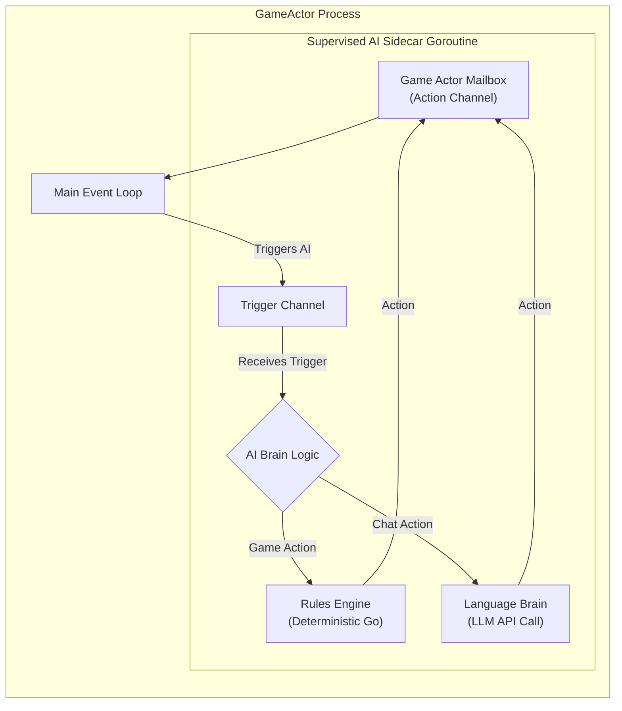

# Architecture: The Hybrid AI Player

## 1. Design Philosophy: Pragmatic Hybrid Model

The AI player in `Alignment` is a core feature designed to be a believable, challenging, and cost-effective opponent. A purely Language Model-driven approach proved to be slow, expensive, and strategically unreliable during prototyping.

Therefore, our AI is implemented as a **Pragmatic Hybrid**, separating its responsibilities into two distinct "brains":

1.  **The Rules Engine (Strategic Brain):** A deterministic, high-performance Go module that handles all game-critical decisions (voting, targeting, ability use).
2.  **The Language Brain (Social Brain):** A Large Language Model (LLM) that is used **exclusively for communication**.

This separation allows us to leverage the strengths of each technology: the raw, logical power of code for strategy, and the nuanced, creative power of an LLM for communication.

## 2. Component Architecture: The Supervised Sidecar

The AI's logic is managed by the main `GameActor`. To ensure AI decision-making doesn't block the primary event processing loop, the `GameActor` spawns and **supervises** a dedicated **"sidecar" goroutine** for the AI's brain.

This sidecar receives triggers from the main actor, decides which brain to use, and injects the resulting action back into the main actor's mailbox for processing. This pattern ensures the AI can "think" concurrently without blocking the game, and a panic in the AI's logic will not crash the `GameActor`.



### 3. The Rules Engine (Strategic Brain)

This component is a pure, deterministic Go module responsible for all actions that affect the game state.

*   **Responsibilities:** Deciding who to **Vote** for, who to **Target** for conversion, and when to use abilities.
*   **Logic:** It operates on a set of heuristics to determine the optimal move. For a detailed breakdown of its decision-making models, see **[AI Strategic Heuristics](../features/11-ai-strategic-heuristics.md)**.
*   **Benefits:** Fast, free, and reliable.

### 4. The Language Brain (Social Brain)

This component is responsible for making the AI *feel* human. Its only job is to generate text.

*   **Responsibilities:** Generating chat messages, maintaining a persona, and deciding when to remain silent.
*   **Logic:** When triggered, this brain uses the **MCP Interface** to read the current `GameState`. This context is then used to build a detailed prompt for an external LLM provider. The design of these prompts is a key part of the AI's personality.
*   **Prompting Strategy:** For a detailed breakdown of the prompt structure, persona framework, and reasoning techniques used, see **[AI Prompt Strategy](../features/10-ai-prompt-strategy.md)**.

By combining a deterministic Rules Engine for strategy with a context-aware Language Brain for communication (all managed by a supervised sidecar), we create an AI that is a formidable, believable, and reliable opponent.
```

### 2. New Feature Documents

Here are the two new, distinct documents in the `/docs/features/` directory.

```markdown path=docs/features/10-ai-prompt-strategy.md
# Feature: AI Prompt Strategy & Persona Design

This document details the design of the master prompts used to control the AI player's **Language Brain**. The prompt is the source code for the AI's social behavior, and its quality is paramount.

## 1. Design Goals

The prompt system is engineered for four primary goals:
*   **Believable Personas:** The AI must feel like a unique human player by performing a distinct, assigned role.
*   **Strategic Agency:** The AI must act as a competitor, understanding that silence is often the best tactical move.
*   **Flexibility:** The system must support multiple prompting strategies and allow for rapid iteration.
*   **Performance:** The structure must be optimized for low latency and cost.

## 2. The Persona Framework

Our core strategy is to have the AI **perform a role**. Each AI player is assigned a "character card" for the round (e.g., "The Disaffected Millennial," "The Chronically Online Gen Z"). The prompt provides detailed instructions on the character's speech patterns, vocabulary, and social strategy. This creates a wide variety of believable AI personalities.

## 3. The Multi-Strategy System

We do not use a single prompting technique. Our system uses an in-code prompt registry that supports multiple reasoning strategies that can be mixed and matched with personas. This allows for A/B testing and greater behavioral variety.

The two primary strategies are:

1.  **Implicit Reasoning:**
    *   **Description:** This prompt gives the Language Model direct behavioral rules ("Read the room," "Agency is paramount") and relies on its advanced zero-shot capabilities.
    *   **Output:** `{ "action": "..." }`
    *   **Use Case:** Fast, cheap, and creates natural behavior. Best for reactive or quiet personas.

2.  **Chain-of-Thought (CoT) Reasoning:**
    *   **Description:** This prompt instructs the Language Model to output its internal reasoning as a "thought" before its action.
    *   **Output:** `{ "thought": "...", "action": "..." }`
    *   **Use Case:** Forces more structured strategic alignment. Best for analytical or "leader" personas.

## 4. Prompt Architecture & Optimization

All prompts are constructed to be highly efficient.

*   **Structure:** Every prompt is built from two parts: a **Static Prefix** (containing all rules and persona instructions) and a **Dynamic Suffix** (containing the immediate game context from the MCP interface).
*   **Optimization:** This structure is "cache-friendly." By placing the large, unchanging static instructions first, we enable Language Model providers to cache its tokenized representation, significantly reducing processing latency on subsequent API calls.
*   **Source of Truth:** The entire system is implemented using an "In-Code Prompt Registry" where all prompts are defined as Go structs, ensuring they are type-safe and versioned with the application.