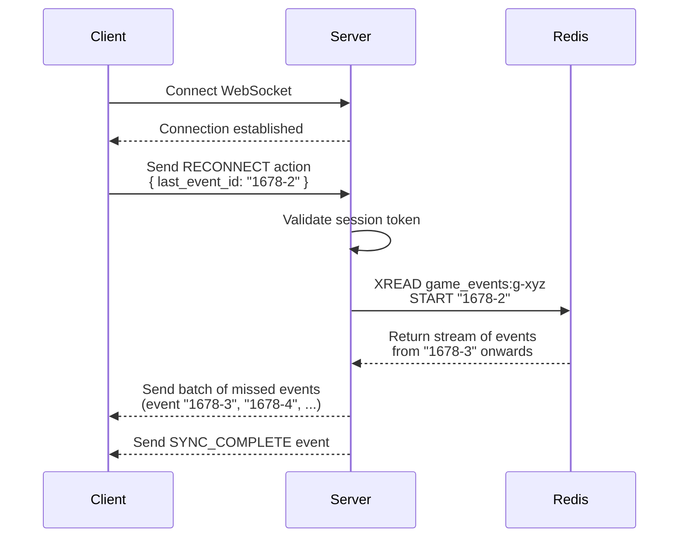

# Architecture: Reconnect and Catch-up

This document describes the mechanism for allowing players with unstable network connections to seamlessly rejoin a game in progress. The primary goal is to provide an excellent user experience by efficiently sending only the necessary data to bring the client's state up-to-date.

## 1. Core Concept

The client is responsible for tracking the last event it successfully processed. On reconnection, it sends this information to the server, which then provides a "delta" of all the events that have occurred since. This avoids sending the entire game history on every reconnect.

## 2. The Reconnect Flow

The process is a well-defined handshake between the client and server.

1.  **Client Stores ID:** After processing any event from the server, the client saves that event's `event_id` to its local storage (e.g., `localStorage`).
2.  **Client Sends `RECONNECT`:** Upon establishing a new WebSocket connection, the client immediately sends a `RECONNECT` action. This action includes its `game_id`, `player_id`, `session_token`, and the `last_event_id` from local storage.
3.  **Server Validates:** The server first validates the `session_token` to ensure the request is legitimate.
4.  **Server Fetches Delta:** The server uses the `last_event_id` as the starting point for a Redis `XREAD` command on the game's event stream. This command is highly efficient and tells Redis to return only the entries that occurred *after* the provided ID.
5.  **Server Sends Batch:** The server sends this batch of missed events to the reconnecting client over the WebSocket.
6.  **Server Sends `SYNC_COMPLETE`:** After the last event in the batch has been sent, the server sends a final, private `SYNC_COMPLETE` event. This is the signal for the client's UI to hide any loading indicators, "un-blur" the screen, and show the fully synchronized game state.

## 3. Benefits of this Approach

*   **Efficiency:** Minimizes network traffic by never re-sending data the client has already seen.
*   **Low Server Load:** Leverages a native, highly optimized Redis command, avoiding the need for the server to load the entire ev
