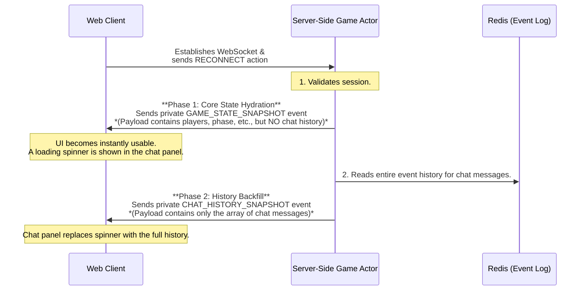

# Architecture: Reconnect & State Synchronization

This document describes the mechanism for allowing players with unstable network connections to seamlessly rejoin a game in progress. The primary goal is to provide an excellent user experience by efficiently sending only the necessary data to bring the client's state up-to-date.

## 1. Core Concept: "Hydrated Core Snapshot" with "Lazy History"

Our reconnect strategy is designed for maximum robustness and a fast user experience. We use a **two-phase synchronization** process that separates critical game state from non-essential historical data.

1.  **Phase 1: Core State Hydration (Snapshot):** The server immediately sends a complete, authoritative snapshot of the *essential* game state. This includes player lists, token counts, the current phase, and the player's private role information—everything needed to make the UI interactive. This allows the client to become usable almost instantly.

2.  **Phase 2: History Backfill (Lazy Load):** After the core state is delivered, the server sends a second, separate message containing non-critical historical data, such as the full chat log. This allows the client to populate secondary UI elements (like the chat scrollback) without blocking the initial render.

This pattern prevents the UI from "hanging" while parsing a large payload and provides a superior, responsive user experience.

## 2. The Reconnect Flow

The process is a well-defined handshake between the client and server.

1.  **Client Connects & Requests Sync:** A player with an existing session token connects and sends a `RECONNECT` action.
2.  **Server Sends Core Snapshot:** The `GameActor` for that game receives the request. It generates a player-specific `GAME_STATE_SNAPSHOT` event containing the essential, current state of the game and sends it privately to the client. This snapshot intentionally omits large, non-critical data like the chat history.
3.  **Client Hydrates Core State:** The client's Wasm engine receives the snapshot and uses it to replace its entire local game state. The main UI instantly re-renders with the correct player list, phase, and token counts, becoming fully interactive.
4.  **Server Sends History:** After sending the snapshot, the `GameActor` reads the full event history from Redis, compiles the chat log, and sends it in a separate, private `CHAT_HISTORY_SNAPSHOT` event.
5.  **Client Backfills History:** The client receives the chat history and uses it to populate the chat panel's scrollback.

## 3. Benefits of This Architecture

*   **Fast Perceived Performance:** The client UI becomes usable and accurate almost instantly, as it only needs to process the small, critical core state first.
*   **Robustness & Self-Healing:** This pattern is incredibly robust. If a client's local state ever becomes corrupted, a simple reconnect will always fix it by loading the authoritative server snapshot.
*   **No Race Conditions:** This two-phase model cleanly separates the urgent state from the less-urgent history, eliminating the race conditions that can occur when trying to process a rapid burst of many small events in a specific order.
*   **Simplified Client Logic:** The client does not need complex logic to manage event ordering or replay. It loads a core snapshot and then separately populates its history.

This architecture provides the ideal balance of immediate responsiveness and eventual consistency for all UI elements.
