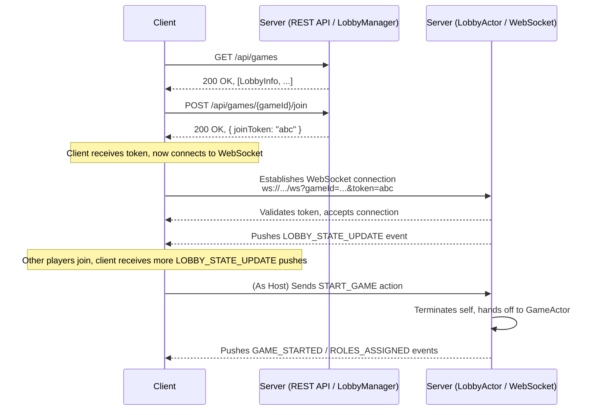

# Architecture: Lobby and Matchmaking System

This document outlines the architecture for the `Alignment` pre-game lobby system. The design uses a hybrid approach, leveraging both a traditional REST API and a real-time WebSocket connection to provide an efficient and scalable player experience.

## 1. Core Philosophy: The Right Tool for the Job

The player journey involves two distinct phases, each best served by a different protocol:

1.  **Stateless Discovery (REST API):** Finding, listing, and creating games are one-time, stateless actions. A standard REST API is the ideal tool for this. It is simple, cacheable, and does not require a persistent connection for every user browsing the lobby list.

2.  **Stateful Participation (WebSocket):** Once a player commits to a lobby, their experience becomes stateful and real-time. They need immediate updates when other players join or leave. A persistent WebSocket connection is the perfect tool for this, allowing the server to *push* state changes to the client instantly.

This hybrid model is the standard for modern session-based games.

## 2. Architectural Components

The system is managed by two primary server-side components that build on our existing Actor Model.

*   **The `LobbyManager`:** A singleton that manages the lifecycle of all pre-game lobbies. It is responsible for handling the REST API requests.
*   **The `LobbyActor`:** A lightweight, dedicated goroutine for each individual lobby. It is responsible for managing the state of a single waiting room and communicating with connected players over WebSockets.

## 3. The User & System Flow

The diagram below illustrates the end-to-end flow from browsing to game start.

## 4. API & Protocol Definitions

#### **REST API Endpoints**

*   `GET /api/games`:
    *   **Description:** Lists all public, waiting game lobbies.
    *   **Response:** `200 OK` with `[{ "id": string, "name": string, "player_count": int, "max_players": int }]`

*   `POST /api/games`:
    *   **Description:** Creates a new game lobby.
    *   **Response:** `201 CREATED` with `{ "game_id": string, "host_token": string }`

*   `POST /api/games/{gameId}/join`:
    *   **Description:** Requests to join an existing lobby.
    *   **Response:** `200 OK` with `{ "join_token": string }` or `403 Forbidden` if the lobby is full.

#### **WebSocket Endpoint**

*   `GET /ws?gameId={gameId}&token={joinToken}`:
    *   **Description:** The primary real-time communication channel.
    *   **Logic:** The server validates the `joinToken`. If valid, the connection is upgraded, and the token is consumed.

#### **Real-time Events (in the Lobby)**

*   **`LOBBY_STATE_UPDATE` (Server → Client):** Broadcast to all players in a lobby whenever the player list changes.
    *   **Payload:** `{ "host_id": string, "players": [PlayerObject, ...] }`
*   **`START_GAME` (Client → Server):** Action sent by the host to begin the game.
*   **`GAME_STARTED` (Server → Client):** Broadcast to all players in the lobby to signal the transition to the main game view and role assignment.

This architecture provides a clean, secure, and scalable foundation for the player's pre-game experience.