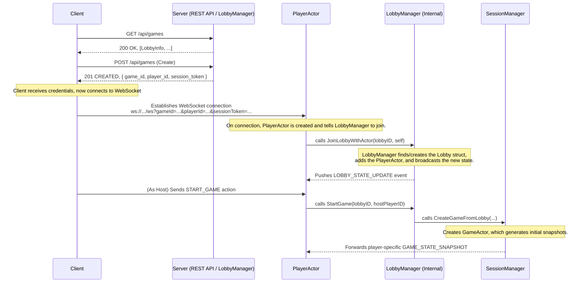

# Architecture: Lobby and Matchmaking System

This document outlines the architecture for the `Alignment` pre-game lobby system. The design uses a hybrid approach, leveraging a traditional REST API for discovery and a persistent WebSocket connection managed by a `PlayerActor` for all stateful interactions.

## 1. Core Philosophy: The Right Tool for the Job

The player journey involves two distinct phases, each best served by a different protocol:

1.  **Stateless Discovery (REST API):** Finding and listing available games are one-time, stateless actions. A standard REST API is the ideal tool for this. It is simple, cacheable, and does not require a persistent connection for every user browsing the lobby list.
2.  **Stateful Participation (WebSocket + PlayerActor):** Once a player commits to a lobby, their experience becomes stateful and real-time. All interactions from this point forward are handled over a single, persistent WebSocket connection owned by a dedicated **`PlayerActor`**. This actor manages the player's session state and allows the server to *push* updates instantly.

This hybrid, player-centric model is the standard for modern session-based games.

## 2. Architectural Components

The system is managed by three primary server-side components, all built on our `PlayerActor`-centric session management architecture:

*   **`PlayerActor`:** The core of the system. A dedicated goroutine that owns a single player's WebSocket connection and manages their session as a state machine (`Idle` -> `InLobby` -> `InGame`).
*   **The `LobbyManager`:** A singleton that orchestrates pre-game lobbies. It does not own connections; it manages a list of `Lobby` data structures and processes requests from `PlayerActor`s (e.g., "start the game").
*   **`Lobby` Data Structure:** A lightweight, thread-safe struct representing a single lobby. Its primary job is to hold a list of references to the `PlayerActor`s currently in that lobby.

## 3. The User & System Flow

The diagram below illustrates the end-to-end flow from browsing to game start, highlighting the central role of the `PlayerActor`.

## 4. API & Protocol Definitions

#### **REST API Endpoints**

*   `GET /api/games`:
    *   **Description:** Lists all public, waiting game lobbies.
    *   **Response:** `200 OK` with `[{ "id": string, "name": string, "player_count": int, "max_players": int, "status": "WAITING" }]`

*   `POST /api/games`:
    *   **Description:** Creates credentials for a new game lobby. **Does not create the lobby itself.**
    *   **Response:** `201 CREATED` with `{ "game_id": string, "player_id": string, "session_token": string }`

*   `POST /api/games/{gameId}/join`:
    *   **Description:** Requests credentials to join an existing lobby.
    *   **Response:** `200 OK` with `{ "player_id": string, "session_token": string }` or `403 Forbidden` if the lobby is full.

#### **WebSocket Connection**

*   `GET /ws?gameId={gameId}&playerId={playerId}&sessionToken={sessionToken}`:
    *   **Description:** The primary real-time communication channel.
    *   **Logic:** The server validates the `sessionToken`. If valid, a `PlayerActor` is created, and the token is consumed. The `PlayerActor` then automatically joins the specified lobby, creating it if it's the first to join.

#### **Real-time Events (in the Lobby)**

*   **`LOBBY_STATE_UPDATE` (Server → Client):** Sent to a `PlayerActor` whenever the lobby state changes.
    *   **Payload:** `{ "lobby_id": string, "host_id": string, "players": [PlayerInfo, ...], "can_start": boolean }`
*   **`START_GAME` (Client → Server):** Action sent by the host's `PlayerActor` to begin the game.
*   **`GAME_STATE_SNAPSHOT` (Server → Client):** Sent to a `PlayerActor` during the atomic lobby-to-game transition, containing their player-specific game state view.

## 5. Key Architectural Benefits

This `PlayerActor`-centric model provides several advantages over traditional lobby actor approaches:

1.  **Unambiguous Session Ownership:** Each WebSocket connection has exactly one owner, eliminating race conditions.
2.  **Atomic Transitions:** The handoff from lobby to game is a simple, server-side state machine transition within each `PlayerActor`, requiring no connection drops or reconnects.
3.  **Session Continuity:** Players maintain a single, persistent WebSocket connection throughout their entire session.
4.  **Robust Disconnection Handling:** `PlayerActor`s properly clean up their state from any lobby or game they are part of when they disconnect.
