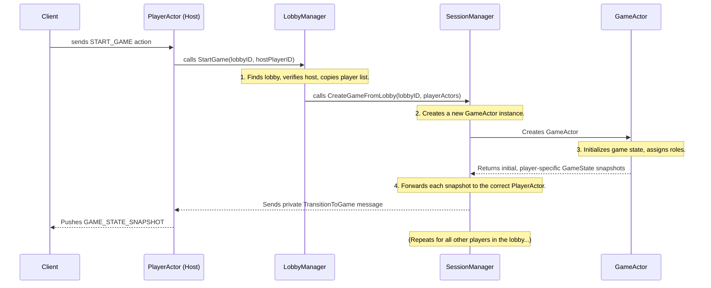

# Architecture: PlayerActor Session Management

This document outlines the authoritative architecture for real-time session management in `Alignment`. This model is the definitive approach for handling player connections, lobby state, and game transitions, designed to be robust, scalable, and free of race conditions.

## 1. Core Philosophy: One Connection, One Player, One Actor

The entire session management system is built on a single, clear principle: **a persistent WebSocket connection is a player's session, and that session is managed by a single, dedicated `PlayerActor` goroutine.**

This actor is created the moment a player's WebSocket connection is established and lives for the entire duration the player is connected. It functions as a state machine, transitioning between different contexts (e.g., browsing lobbies, waiting in a specific lobby, playing a game) without ever dropping the underlying network connection.

This model provides **unambiguous session ownership**, which is the key to eliminating the deadlocks and race conditions that plague more complex "handoff" architectures.

## 2. Architectural Components

The system is composed of several components with clearly defined roles:

*   **`PlayerActor` (The State Machine):** The star of the show. A dedicated goroutine that owns a single WebSocket connection. It maintains the player's current state (`Idle`, `InLobby`, `InGame`) and is the only component that can write messages back to that specific client. It receives actions from its client and routes them to the appropriate manager.
*   **`LobbyManager` (The Lobby Orchestrator):** A singleton that manages the lifecycle of all pre-game lobbies. It **does not own connections**. It simply maintains a list of `Lobby` data structures and tells `PlayerActor`s when their state should change based on lobby-related actions.
*   **`SessionManager` (The Game Orchestrator):** A singleton responsible for creating and managing active `GameActor`s. It orchestrates the atomic transition of a group of `PlayerActor`s from a lobby into a game.
*   **`Lobby` (The Data Structure):** A simple, thread-safe struct that represents a single lobby. Its primary content is a map of `playerID` to `PlayerActor` references. It is a piece of data, not an actor.
*   **`GameActor` (The Game Engine):** A dedicated goroutine that owns and executes the simulation for a single game instance. It processes game logic and broadcasts state updates back to the `SessionManager`, which then forwards them to the relevant `PlayerActor`s.

## 3. The Lobby-to-Game Transition: A Deadlock-Free Flow

The player-centric model makes the previously fragile lobby-to-game "handoff" a simple, atomic, and entirely server-side operation.

**The key steps:**

1.  **Host Action:** The host's client sends a `START_GAME` action over its persistent WebSocket. The host's `PlayerActor` receives it.
2.  **Orchestration:** The `PlayerActor` calls `lobbyManager.StartGame()`. The `LobbyManager` verifies the request and asks the `SessionManager` to create the game, passing it the list of `PlayerActor`s from the lobby.
3.  **Game Initialization:** The `SessionManager` spawns a new `GameActor`. The `GameActor` immediately initializes the full game state, including assigning roles and alignments. It then generates a unique, player-specific `GameState` snapshot for every player.
4.  **State Transition & Delivery:** The `SessionManager` sends a private `TransitionToGame` message to each `PlayerActor` from the lobby. This message contains that player's specific snapshot.
5.  **Client Update:** Each `PlayerActor` receives the message, changes its internal state to `InGame`, and pushes the `GAME_STATE_SNAPSHOT` payload down its WebSocket to its client.

There is no connection dropping, no reconnecting, and no ambiguity. The entire transition is a clean, server-side state change.

## 4. Benefits of This Architecture

*   **Unambiguous Session Ownership:** One connection, one player, one actor. This is the bedrock of the system's stability.
*   **Elimination of Race Conditions:** State transitions are simple messages sent between actors, not complex handoffs of network resources.
*   **Simplified Client Logic:** The client maintains a single, stable WebSocket for its entire lifecycle.
*   **Scalability and Maintainability:** The architecture provides a clear separation of concerns: `PlayerActor`s manage sessions, `GameActor`s manage simulations, and `Manager`s orchestrate.
