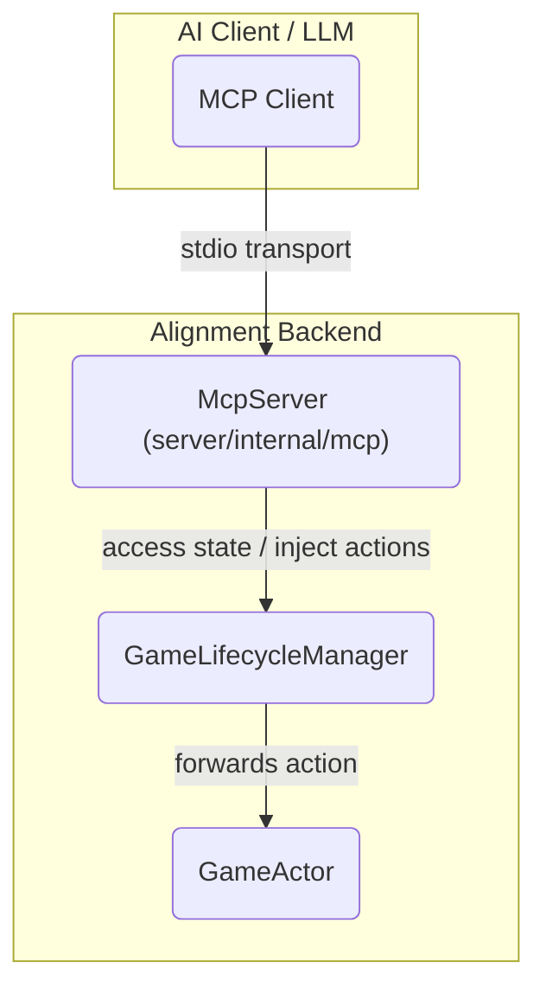

# Architecture: The MCP Server for AI Interaction

This document provides a detailed overview of the Model Context Protocol (MCP) server implemented within the `Alignment` backend. This server is the cornerstone of our hybrid AI strategy, providing a secure and standardized API for AI agents to interact with the game.

## 1. Philosophy: A Secure Gateway for AI

Our AI architecture separates the AI's "brains": a deterministic `RulesEngine` for strategy and a creative `LanguageBrain` for communication. The MCP server is designed to serve both, acting as a single, unified gateway.

The core design principles are:

1.  **Read-Only by Default:** The primary role of the MCP server is to provide **read-only context**. The AI can read the public `GameState` to understand the situation, but it cannot directly access or modify the server's internal state.
2.  **Actions as Tools:** All state-changing actions an AI can perform are exposed as explicit `Tools`. An AI cannot vote, mine, or chat without successfully calling a well-defined tool with validated parameters.
3.  **Standardization:** By adhering to the MCP standard, we can leverage a growing ecosystem of clients and testing tools (like the official `mcp-inspector`), and we ensure our AI interface is robust and well-documented.

## 2. Architectural Placement

The `McpServer` is a component within the main Go backend process. It is initialized in `cmd/server/main.go` and can be run in a special `-mcp` mode, which configures it to use `stdio` for transport, making it compatible with local AI clients and debugging tools.

The server has a direct dependency on the `GameLifecycleManager`, which it uses as a broker to access game state and inject actions into the correct `GameActor`.



## 3. Core Capabilities Exposed

The server declares two primary capabilities during the MCP `initialize` handshake: `resources` and `tools`.

### `resources`: Providing Game Context

This capability allows the AI to understand "what is happening" in the game.

*   **`resources/list`:** The server responds by advertising a single resource template:
    *   **URI Template:** `game://alignment/{game_id}`
    *   This tells the client how to ask for the state of a specific game.

*   **`resources/read`:** When a client requests a resource like `game://alignment/g-xyz`, the server performs these critical steps:
    1.  **Fetch State:** It retrieves the full, authoritative `GameState` from the relevant `GameActor`.
    2.  **FILTER STATE:** It passes the state through a security filter (`FilterGameStateForAI`) to create a `PublicGameState` view. **This is the most important security step.** It strips all secret information (e.g., other players' alignments and roles) that the AI should not know.
    3.  **Return Public View:** It returns only the safe, public version of the state to the client.

### `tools`: Enabling AI Actions

This capability allows the AI to "do things" in the game. All actions are funneled through the `tools/call` method.

#### **Tool 1: `send_chat_message` (for the Language Brain)**
*   **Purpose:** Allows the AI to participate in the in-game chat.
*   **Input Schema:** `{ "game_id": string, "message": string }`
*   **Logic:**
    1.  The `McpServer` validates the arguments.
    2.  It constructs a `core.Action` with `Type: core.ActionSendMessage`.
    3.  It uses the `GameLifecycleManager` to inject this action into the correct `GameActor`'s mailbox.
    4.  The `GameActor` processes this action just like it would a message from a human player.

#### **Future Tools (for the `RulesEngine`)**
The design is extensible for the `RulesEngine`. When the RulesEngine decides on a strategic move, it will do so by calling a tool. The `McpServer` is already structured to handle this, with placeholder schemas and `case` statements for future tools:

*   `vote_for_player(game_id, target_player_id)`
*   `use_ability(game_id, ability_name, target_player_id?)`
*   `mine_for_player(game_id, target_player_id)`

This ensures that *all* AI-driven state changes, whether social or strategic, follow the same secure, auditable "Tool Call" pathway.

## 4. Running & Testing with the `mcp-inspector`

The use of a standard protocol provides immediate benefits for development and testing. We can use official MCP tools to interact with our server.

1.  **Run the Server in MCP Mode:**
    Start the backend with the `-mcp` flag. This tells `main.go` to bypass the HTTP server and start the `McpServer` listening on `stdio`.
    ```bash
    go run ./cmd/server -mcp
    ```

2.  **Connect with the Inspector:**
    In a separate terminal, use `npx` to run the official MCP inspector tool. It will launch a web-based UI for interacting with our server.
    ```bash
    npx @modelcontextprotocol/inspector go run ./cmd/server -mcp
    ```

Using the inspector, you can:
*   Verify the capabilities reported during the `initialize` handshake.
*   Browse the `resources` and see the `game://alignment/{game_id}` template.
*   List the `tools` and see the `send_chat_message` tool with its schema.
*   Manually `call` the tool to send messages into a live game, providing a powerful way to debug the entire pipeline.


Of course. I will first add the "Contract with main.go" section to the architecture document, and then write the corresponding GitHub issue for testing and integration.

<execute_bash>
MODEL_RESPONSE_UPDATE_TARGET_PATH="docs/architecture/13-mcp-server-for-ai.md"
MODEL_RESPONSE_UPDATE_STRATEGY="APPEND"
</execute_bash>
```markdown
---

## 5. Contract with `main.go`

The relationship between the main application (`server/cmd/server/main.go`) and the `mcp` package is a clear contract based on **Inversion of Control** and **Dependency Injection**.

*   **`main.go` (The "Application Host"):** The main application is responsible for building and running the entire game. It decides *if* and *when* the MCP server runs. By checking for the `-mcp` command-line flag, `main.go` makes a choice:
    *   If **false**, it starts the standard HTTP/WebSocket server for human players.
    *   If **true**, it cedes control of the process to the MCP server by calling `mcpServer.Run()`, which takes over `stdio`.

*   **`mcp` Package (The "AI Relations Department"):** This package is a specialized component that knows how to communicate with an external AI using the formal MCP protocol.

The contract defines what each part promises to provide to the other.

#### **A. The Application's Promise (`main.go` → `mcp`)**

`main.go` promises to provide the `McpServer` with a single, powerful handle to the game's core systems: the `GameLifecycleManager`.

```go
// In main.go
lifecycleManager := lifecycle.NewGameLifecycleManager(...)
mcpServer := mcp.NewMcpServer(lifecycleManager) // <-- The Promise
```

By injecting this dependency, the main application gives the `McpServer` a "keycard" with specific, high-level permissions to:
1.  Look up any running game via `GetGameActor`.
2.  Submit any valid player action into a game via `SendActionToGame`.

#### **B. The MCP Server's Promise (`mcp` → `main.go`)**

The `mcp` package, in return, makes three promises to the main application:

1.  **Protocol Abstraction:** It handles all the low-level details of the MCP protocol. The rest of the application (`GameLifecycleManager`, `GameActor`) remains completely ignorant of JSON-RPC or `stdio`. It only ever deals with high-level `core.Action` structs.
2.  **Secure Translation:** It translates incoming MCP requests into safe, high-level calls on the `GameLifecycleManager`. A `tools/call` for `send_chat_message` becomes a `core.Action` and is injected into the game.
3.  **Information Security:** It **guarantees** that it will **never** send raw, unfiltered `GameState` to an AI client. Every `resources/read` request is passed through the `FilterGameStateForAI` function to strip secret information before a response is sent.

This clean contract allows the game's core logic to evolve independently from its AI interface, ensuring security and maintainability.
