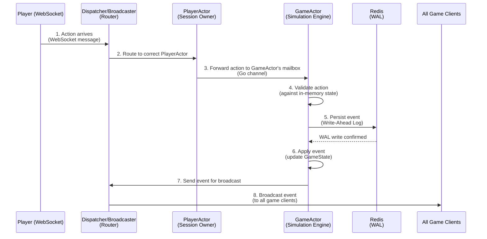

# Backend Architecture Overview

This document provides a high-level overview of the `Alignment` backend architecture. Our design philosophy prioritizes **low latency, high concurrency, and operational resilience** on a single-machine deployment.

To achieve this, we have implemented a **stateful, player-centric, supervised Actor Model**. Each player's session is managed by its own actor, which then interacts with a separate actor that runs the game simulation.

---

## Core Components

The backend is composed of several key, concurrent components that work together. Understanding their distinct roles is key to understanding the system.

*   **The `PlayerActor` (The Session Owner):** The cornerstone of our architecture. A dedicated goroutine is spawned for each client WebSocket connection, "owning" that player's session. It functions as a state machine (`Idle`, `InLobby`, `InGame`) and is the single point of contact for a player's client. It receives actions from the client and forwards them to the appropriate manager or `GameActor`.

*   **The `Dispatcher` (The Router):** The central hub for all incoming WebSocket messages. It routes each message to the correct `PlayerActor`'s mailbox. It no longer routes directly to `GameActor`s. On the way out, it acts as a broadcaster, taking events and sending them to all relevant connected clients.

*   **The `GameActor` (The Simulation Engine):** A dedicated goroutine that "owns" a single game simulation. It holds the `GameState` in memory and processes all game logic serially. It receives actions from the `PlayerActor`s participating in its game.

*   **The `Supervisor` (The Guardian):** The top-level goroutine that launches and monitors all active **`GameActor`s**. Its primary role is fault isolation; if a single `GameActor` panics, the Supervisor contains the failure, protecting the rest of the server.

*   **The `Scheduler` (The Metronome):** A single, highly-efficient goroutine that manages all time-based events for the entire server (e.g., phase timers, AI thinking delays). It uses a **[Timing Wheel](../glossary.md#timing-wheel)** algorithm to handle thousands of timers with minimal overhead.

*   **Redis (The Scribe):** Our external persistence layer. It is used exclusively as a **[Write-Ahead Log (WAL)](../glossary.md#wal-write-ahead-log)** to record the event history and for storing **State Snapshots** to enable fast recovery. **It is not read from during normal gameplay.**

## System Flow Diagram

This diagram illustrates the data path of a user action through the primary components.

```ascii
+----------+      +------------+      +---------------+      +-----------+
| WebSocket|----->| Dispatcher |----->| PlayerActor   |----->| Game      |
| Connection      | (Routes msg)      | (Session Owner) |      | Actor     |
+----------+      +------------+      +---------------+      | (In-Memory|
                               |              ^                 |  State)   |
                               |              | (Time's Up)     |           |
                               |              |                 |           |
                               |      +------------------+      |           |
                               +----->|   Scheduler      |<-----+           |
                                      | (Timing Wheel)   |  (Schedule Timer)
                                      +------------------+
```

## The Lifecycle of a Player Action

This diagram shows the sequence of events for a single player action.



## Deep Dives

This document is a high-level map. For detailed implementations and logic, please refer to the following documents:

*   **[Supervisor & Resiliency](./01-supervisor-and-resiliency.md):** A detailed look at the Supervisor, Health Monitor, and Admission Controller that protect the server from crashes and overload.
*   **[AI Player Design](./02-ai-player-design.md):** An explanation of our Hybrid AI model, separating the Rules Engine from the Language Model.
*   **[MCP Interface](./03-mcp-interface.md):** The formal specification for the read-only API we use to provide game context to the AI's language model.
