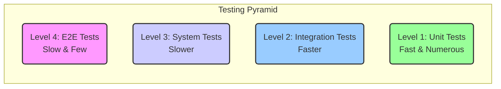

# Enforcing Best Practices by Design & Testing

This document describes how we ensure code quality, maintainability, and correctness.

## **1. Enforcement by Design**

The best way to prevent bugs is to make them impossible to write. We enforce best practices through our architectural patterns.

1.  **Interfaces for Decoupling:** We use interfaces to define contracts between our system's components.
    *   **Example:** The `GameActor` does not know about Redis. It talks to a `DataStore` interface (`type DataStore interface { AppendEvent(...) }`). In production, we inject a `RedisStore`. In tests, we inject a `MockStore`.
    *   **Enforcement:** This design *forces* a developer to decouple the actor's logic from its dependencies. You cannot write a Redis-specific command inside the actor because the interface doesn't allow it.

2.  **Package Structure by Domain:** Our code is organized by its logical boundary, not by type.
    *   **Example:** Universal game rules are in `/core`. Server-side logic (Actors, AI) is in `/server`. Client-side logic (UI, Wasm) is in `/client`.
    *   **Enforcement:** This creates clear, compiler-enforced boundaries. For example, the `/core` package cannot import `/server`, preventing universal rules from depending on server infrastructure. Code review should strictly enforce these import boundaries.

3.  **Encapsulation via Unexported Fields:**
    *   **Example:** The `GameState` struct may have internal fields for tracking vote counts (`voteTally map[string]int`). By making this field unexported (lowercase `v`), only methods within the same package can modify it, preventing accidental manipulation from other parts of the codebase.
    *   **Enforcement:** This is enforced directly by the Go compiler.

## **2. Enforcement by Testing: The Testing Pyramid**

We employ a multi-layered testing strategy, visualized by the testing pyramid. This strategy prioritizes a large number of fast, simple unit tests at the base and progressively fewer, more complex tests at higher levels.



**Level 1: Unit Tests (The Foundation)**

*   **Target:** Pure logic (`ApplyEvent`, `RulesEngine`).
*   **What to Test:** Every possible input and edge case. For `ApplyEvent`, this means one test case for every event type. For the `RulesEngine`, this means testing its decisions in various game states (e.g., "Does it correctly target the player with the lowest tokens?").
*   **Technique:** **Table-Driven Tests**. This is the standard in Go.
    ```go
    // Test for ApplyEvent
    func TestApplyEvent(t *testing.T) {
        testCases := []struct {
            name          string
            initialState  GameState
            event         Event
            expectedState GameState
        }{
            // ... dozens of cases here ...
            {
                name: "mining should add a token",
                initialState: GameState{Players: {"p1": {Tokens: 1}}},
                event: Event{Type: "MINING_SUCCESSFUL", Payload: {"target_id": "p1"}},
                expectedState: GameState{Players: {"p1": {Tokens: 2}}},
            },
        }
        // ... loop and run tests ...
    }
    ```
*   **Enforcement:** We will use a CI check that fails if unit test coverage for core logic packages drops below 95%.

**Level 2: Integration Tests (The Actor)**

*   **Target:** The `GameActor` as a complete, concurrent unit.
*   **What to Test:** The actor's lifecycle and its interaction with its dependencies. We test sequences of actions.
*   **Technique:** **Test the actor as a black box with mocked dependencies.**
    1.  Create a `MockDataStore` that records which events were passed to it.
    2.  Create a `MockBroadcaster` that records which events were broadcast.
    3.  In the test, create a real `GameActor`, injecting these mocks.
    4.  Send a sequence of actions into the actor's input channel.
    5.  Wait a short time for the actor to process them.
    6.  Assert that the `MockDataStore` and `MockBroadcaster` were called with the correct sequence of events.
    ```go
    func TestActor_PlayerJoinsAndVotes(t *testing.T) {
        mockStore := &MockDataStore{}
        actor := NewGameActor("test-game", mockStore, /*...*/)

        // Send actions
        actor.Mailbox <- Action{Type: "JOIN_GAME", ...}
        actor.Mailbox <- Action{Type: "SUBMIT_VOTE", ...}

        time.Sleep(10 * time.Millisecond) // Allow actor to process

        // Assert on what was persisted
        require.Len(t, mockStore.AppendedEvents, 2)
        require.Equal(t, "PLAYER_JOINED", mockStore.AppendedEvents[0].Type)
        require.Equal(t, "VOTE_CAST", mockStore.AppendedEvents[1].Type)
    }
    ```

**Level 3: System Tests (The Supervisor & Health Layer)**

*   **Target:** The highest-level resiliency features.
*   **What to Test:** Failure and overload scenarios.
*   **Technique:** In-memory tests that simulate system-wide conditions.
    *   **Test for Panic Recovery:** Create a `GameActor` that is designed to panic. Launch it via the `Supervisor`. Assert that the test process itself does not panic.
    *   **Test for Admission Control:** Manually set the `HealthStatus` to `"OVERLOADED"`. Call the `HandleCreateGameRequest` function. Assert that it returns the "waitlist" error and that the user ID was added to the (mocked) Redis waitlist.

**Level 4: End-to-End (E2E) Tests (The Full Picture)**
*   **Target:** The entire application stack, running as it would in production.
*   **What to Test:** Critical user flows from the client's perspective. For example, "A user can create a lobby, a second user can join it, and the lobby state is correctly synchronized between them."
*   **Technique:** Use an external test runner to drive the system. We use a **Python script with `pytest`** that acts as a real client, making REST API calls and connecting via WebSocket to a live, running instance of our application (launched via `docker-compose`).
*   **Enforcement:** These tests run in a dedicated CI job (`e2e-tests.yml`) and are critical for catching regressions in the client-server contract or deployment configuration.

**CI/CD Enforcement:**

Our GitHub Actions workflow will have a dedicated "Test" stage that must pass before any PR can be merged:
1.  `go fmt` and `go vet` checks for basic formatting.
2.  `golangci-lint run` to catch stylistic and common errors.
3.  `go test -race ./...` to run all unit and integration tests with the race detector enabled.
4.  `go tool cover` to generate a coverage report and fail the build if it drops below our threshold.