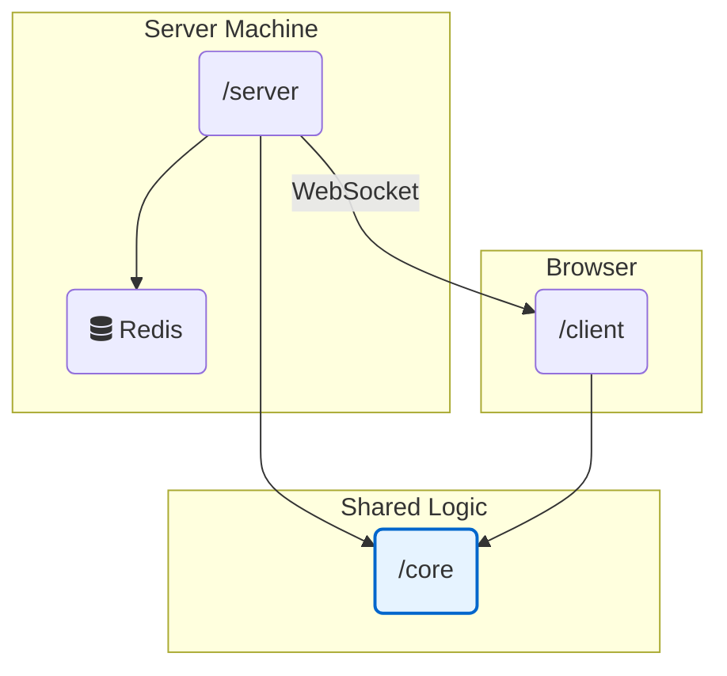

# Development: Code Logic Boundaries

This document defines the strict separation of concerns between the three main Go modules in our monorepo: `/server`, `/client`, and the shared `/core` package. Adhering to these boundaries is critical for security, performance, and maintainability.

## 1. The `core` Package: The Universal Rulebook

The `/core` package is the single source of truth for the *rules of the game*. It is pure, portable, and has zero dependencies on server or client infrastructure.

#### **✅ `core` SHOULD contain:**

*   **Shared Data Structures:** The definitions for `GameState`, `Player`, `Event`, `Action`, etc., with their `json` tags. These are the nouns of our game.
*   **The State Transition Function:** The pure `ApplyEvent(state, event) GameState` function. This is the verb of our game—it defines how the state changes in response to an event.
*   **Pure Rule Checkers:** Simple, stateless functions that encapsulate a game rule, e.g., `CanPlayerAffordAbility(player Player, ability Ability) bool`.

#### **❌ `core` SHOULD NOT contain:**

*   Any network code (no `net/http`, WebSockets, etc.).
*   Any database/Redis-specific code.
*   Any AI logic, heuristics, or prompting code.
*   Any logic related to goroutines, channels, or concurrency.
*   Any frontend-specific code (no `syscall/js`).
*   Any secrets or private server-side logic.

**Mantra:** If you're wondering if code belongs in `/core`, ask: "Does a human player in their browser need this exact same logic to correctly display the game state?" If yes, it probably belongs in `/core`.

---

## 2. The `server` Package: The Authoritative Host

The `/server` package is the authoritative engine that runs the game. It contains all the secure, private, and infrastructure-level logic.

#### **✅ `server` SHOULD contain:**

*   **The Actor Model:** The `Supervisor`, `GameActor`, `LobbyActor`, and all concurrency management.
*   **Network Handling:** The WebSocket server, the `Dispatcher`, the `McpServer`, and the HTTP server for the admin tool.
*   **Persistence Logic:** All code that interacts with Redis (Write-Ahead Log and snapshots).
*   **AI "Brains":**
    *   The **Strategic Brain (Rules Engine)**, including all its heuristics (`calculateThreat`, `calculateSuspicionScore`). This logic is private to the server.
    *   The **Language Brain**, including the `PromptManager`, prompt templates, and the client for calling external LLM APIs.
*   **Security & Validation:** The authoritative validation of all incoming player `Actions` before an `Event` is created.
*   **Time Management:** The central `Scheduler` (Timing Wheel).

#### **❌ `server` SHOULD NOT contain:**

*   Any UI rendering logic.
*   Direct calls to frontend-specific JavaScript functions.

**Mantra:** The server is the trusted, central computer. It holds all the secrets, enforces all the rules, and runs the simulation.

---

## 3. The `client` Package: The Interactive View

The `/client` package is responsible for presenting the game state and capturing user input. It is an interactive, "dumb" client that trusts the server completely.

#### **✅ `client` SHOULD contain:**

*   **The Go/Wasm "Engine":**
    *   The WebSocket client connection logic.
    *   The local, in-memory copy of the `core.GameState`.
    *   The main loop that receives `core.Event`s from the server and updates the local state using the shared `core.ApplyEvent` function.
    *   The "bridge" code (`syscall/js`) that calls JavaScript functions to trigger UI updates.
*   **The React "Shell":**
    *   All UI components (written in React/TypeScript).
    *   Event handlers (`onClick`, `onChange`) that capture user input.
    *   The code that calls exposed Go/Wasm functions to send `core.Action`s to the server.

#### **❌ `client` SHOULD NOT contain:**

*   Any authoritative game logic. The client should never, for example, try to calculate if a vote passed. It simply receives a `VOTE_TALLY_UPDATED` event and displays the result.
*   Any secret state or logic that is not provided by the server.
*   Any AI heuristics or decision-making code.

**Mantra:** The client is a window onto the game world created by the server. Its job is to render what the server tells it and to send user intentions back to the server for validation.

---

### **Visualizing the Boundaries**

