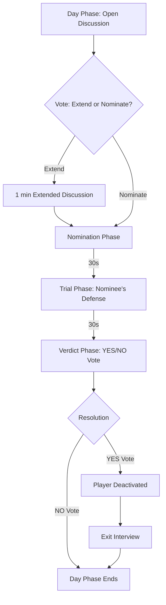

# Feature: Voting & Deactivation Cycle

This document describes the implementation design for the core player elimination loop, as defined in the Game Design Document. This cycle is central to the human faction's gameplay, allowing them to identify and remove suspected AI players.

## 1. Feature Overview

The deactivation cycle is a multi-stage process that occurs during the Day Phase. It involves player nominations, a trial, and a final token-weighted vote to determine if a player is "fired" (eliminated).

## 2. User & System Flow

The process is driven by a series of timed phases managed by the server's **Scheduler**.

1.  **Nomination Phase:** The server changes the phase to `NOMINATION`. The UI on the client un-greys the voting buttons next to each player's name.
2.  **Casting Votes:** A player clicks on another player to vote for them.
    *   **Action:** Client sends `SUBMIT_VOTE` with `payload: { "vote_target_id": "p-bob" }`.
    *   **Logic:** The `Game Actor` validates that it's the correct phase and the player hasn't already voted. It persists a `VOTE_CAST` event (this event is internal and not broadcast, to maintain anonymity).
3.  **Tally & Nomination:** When the 30-second timer expires, the `Game Actor` tallies the votes, weighting each by the voter's `Tokens`.
    *   **Event:** Server broadcasts `VOTE_TALLY_UPDATED` with `type: "NOMINATION"` and `results: { "p-alice": 3, "p-bob": 5 }`.
    *   **Logic:** The player with the highest token-weighted vote is nominated.
4.  **Trial Phase:** The server changes the phase to `TRIAL`. The nominated player's chat input is enabled, while all others' are disabled. The nominee has 30 seconds to make a defense.
5.  **Verdict Phase:** The server changes the phase to `VERDICT`. YES/NO buttons are enabled on the client.
    *   **Action:** Client sends `SUBMIT_VOTE` with `payload: { "verdict": "YES" }`.
    *   **Logic:** The `Game Actor` validates and records the vote.
6.  **Resolution:** The timer expires, and the `Game Actor` tallies the verdict.
    *   **Event:** Server broadcasts `VOTE_TALLY_UPDATED` with `type: "VERDICT"` and `results: { "YES": 7, "NO": 2 }`.
    *   **If YES:**
        1.  The `Game Actor` creates and broadcasts a `PLAYER_ELIMINATED` event, which **reveals the player's role and alignment**.
        2.  The client UI for the eliminated player now shows the "Exit Interview" options.
    *   **If NO:** The player is safe. The Day Phase ends, and the server transitions to the Night Phase.

## 3. Key Implementation Details

*   **Token-Weighted Voting:** All vote tallying logic resides on the server within the `Game Actor`. The client never performs this calculation. The server reads the current `Token` count for each player from its in-memory `GameState` at the moment the vote is cast.
*   **Anonymity:** The server only ever broadcasts the *aggregate* results of a vote. Who voted for whom is kept secret on the server, unless a game mechanic (like the "Total Transparency Initiative" Mandate) changes this rule.
*   **State Machine:** The entire cycle is a finite state machine managed by the `Game Actor` and triggered by timers from the central `Scheduler`. Each phase (`NOMINATION`, `TRIAL`, `VERDICT`) is a distinct state that enables or disables specific actions for clients.