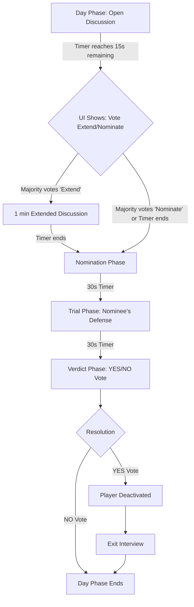

# Feature: Voting & Deactivation Cycle

This document describes the implementation design for the core player deactivation loop, as defined in the Game Design Document. This cycle is central to the human faction's gameplay, allowing them to identify and remove suspected AI players.

## 1. Feature Overview

The deactivation cycle is a multi-stage process that occurs during the Day Phase. It involves open discussion, potential extensions, player nominations, a trial, and a final token-weighted vote to determine if a player is deactivated.

## 2. User & System Flow

The process is driven by a series of timed phases managed by the server's **Scheduler**.

```mermaid
graph TD
    A[Day Phase: Open Discussion] -- Timer reaches 15s remaining --> B{UI Shows: Vote Extend/Nominate};
    B -- Majority votes 'Extend' --> C[1 min Extended Discussion];
    C -- Timer ends --> D[Nomination Phase];
    B -- Majority votes 'Nominate' or Timer ends --> D;
    D -- 30s Timer --> E[Trial Phase: Nominee's Defense];
    E -- 30s Timer --> F[Verdict Phase: YES/NO Vote];
    F --> G{Resolution};
    G -- "YES" Vote --> H[Player Deactivated];
    H --> I[Exit Interview];
    G -- "NO" Vote --> J[Day Phase Ends];
    I --> J;
```

1.  **Open Discussion:** The initial discussion phase begins. The server schedules the end of this phase.
2.  **Vote to Extend:** With 15 seconds remaining in the discussion, the server broadcasts an event that causes the client UI to display buttons for `Extend Discussion` or `Move to Nomination`.
3.  **Nomination Phase:** After the discussion (and any extension), the server changes the phase to `NOMINATION`. The UI on the client enables voting buttons next to each player's name.
4.  **Casting Votes:** A player clicks on another player to vote for them.
    *   **Action:** Client sends `SUBMIT_VOTE` with `payload: { "vote_target_id": "p-bob" }`.
    *   **Logic:** The `GameActor` validates that it's the correct phase and the player hasn't already voted.
5.  **Tally & Nomination:** When the 30-second timer expires (or all players have voted), the `GameActor` tallies the votes, weighting each by the voter's `Tokens`.
    *   **Event:** Server broadcasts `VOTE_TALLY_UPDATED` with `type: "NOMINATION"` and the results.
    *   **Logic:** The player with the highest token-weighted vote is nominated.
6.  **Trial Phase:** The server changes the phase to `TRIAL`. All players can continue to chat, but messages from the nominated player are highlighted in the UI.
7.  **Verdict Phase:** The server changes the phase to `VERDICT`. YES/NO buttons are enabled on the client.
    *   **Action:** Client sends `SUBMIT_VOTE` with `payload: { "verdict": "YES" }`.
8.  **Resolution:** The timer expires, and the `GameActor` tallies the verdict.
    *   **Event:** Server broadcasts `VOTE_TALLY_UPDATED` with `type: "VERDICT"`.
    *   **If YES:** A `PLAYER_DEACTIVATED` event is broadcast, revealing the player's role and alignment.
    *   **If NO:** The player is safe. The Day Phase ends, and the server transitions to the Night Phase.

## 3. Key Implementation Details

*   **Token-Weighted Voting:** All vote tallying logic resides on the server within the `Game Actor`. The client never performs this calculation.
*   **Anonymity:** The server only ever broadcasts the *aggregate* results of a vote by default.
*   **State Machine:** The entire cycle is a finite state machine managed by the `Game Actor` and triggered by timers from the central `Scheduler`.
