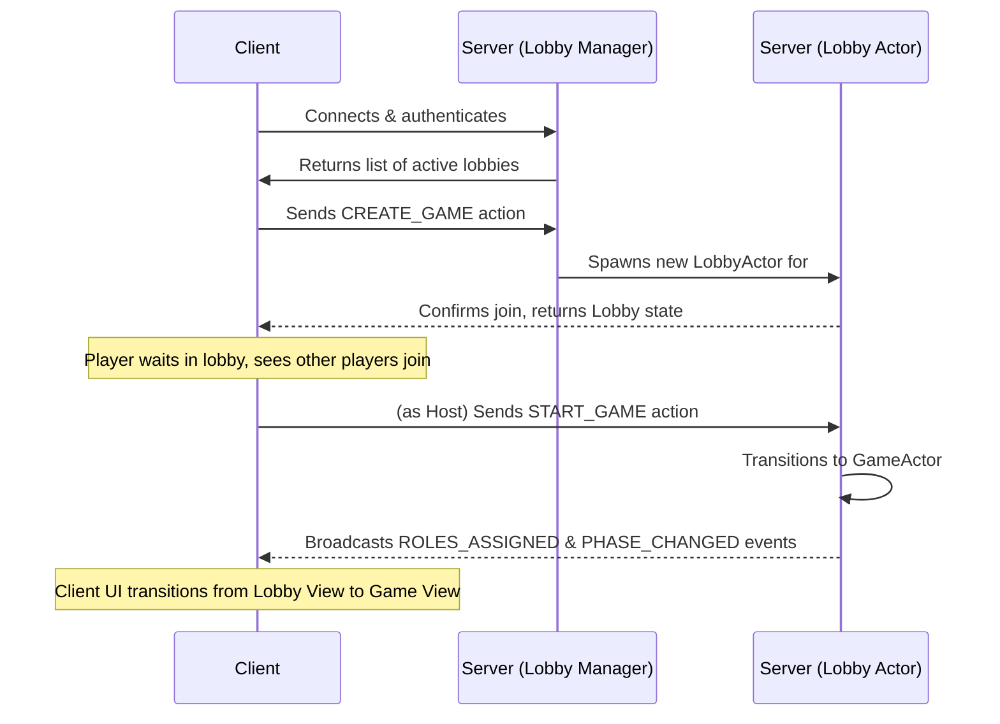

# Feature: Game Lobby & Matchmaking

This document describes the implementation design for the pre-game lobby and matchmaking system. This feature manages the player experience from the moment they log in until a game officially begins.

## 1. Feature Overview

The lobby system allows players to create new game rooms, browse existing open games, and gather with other players before a match starts. It serves as the primary "matchmaking" hub for the application. The system is designed around a central lobby list and individual game lobbies.

## 2. Architectural Approach

The lobby system will be built using our existing **Actor Model architecture**. This provides a consistent and scalable approach without introducing new architectural patterns.

*   **Lobby Actor:** Each active game lobby will be managed by its own lightweight goroutine, a **`LobbyActor`**.
*   **Responsibilities:** The `LobbyActor` is responsible for:
    *   Maintaining the list of connected players in that specific lobby.
    *   Broadcasting `PLAYER_JOINED` and `PLAYER_LEFT` events to all clients in the lobby.
    *   Handling the `START_GAME` action from the host.
*   **State:** The state of a `LobbyActor` is simple, containing a `LobbyID`, a map of `Players`, and the `HostPlayerID`.

When the host starts the game, a "state transition" occurs: the `LobbyActor` passes its state to a newly created `GameActor`.

## 3. User & System Flow

## 4. API Actions & Events

This feature introduces a few new concepts but primarily reuses existing Actions and Events.

#### **Actions:**

*   `CREATE_GAME`: Creates a new lobby and makes the sender the host.
*   `JOIN_GAME`: Joins an existing lobby specified by `game_id`.
*   `START_GAME`: Sent by the host to begin the game.

#### **Events:**

*   **`LOBBY_LIST_UPDATED` (New Event):** Broadcast to all connected clients (not yet in a lobby) whenever a lobby is created, started, or destroyed. This allows the main lobby browser to update in real-time.
    *   **Payload:** `{ "lobbies": [ { "id": string, "name": string, "player_count": int, "max_players": int, "status": string } ] }`
*   `PLAYER_JOINED`: Reused to show a player joining the specific lobby.
*   `PLAYER_LEFT`: Reused to show a player leaving the specific lobby.
*   `ROLES_ASSIGNED` / `PHASE_CHANGED`: These events signal the end of the lobby phase and the successful transition into the main game.

## 5. Key Implementation Details

*   **The Lobby Manager:** A single, top-level supervisor (potentially the main Supervisor) will be responsible for managing the list of all active `LobbyActors` and handling the initial `CREATE_GAME` and `JOIN_GAME` requests before handing the connection off to the specific `LobbyActor`.
*   **Lobby Names:** To make lobbies more user-friendly than UUIDs, the server will generate random, memorable names (e.g., `#lobby-glorious-gerbil`) upon creation.
*   **Timeouts:** Lobbies that remain empty for a certain period (e.g., 10 minutes) will be automatically timed out and destroyed by the Lobby Manager to conserve resources.