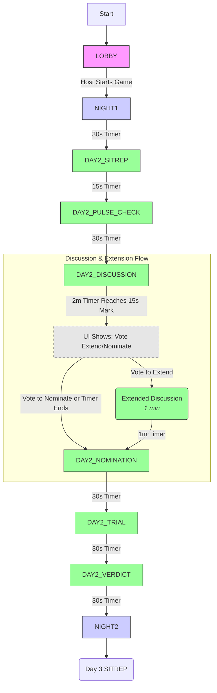
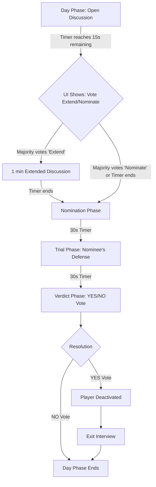

# Feature: Day/Night Cycle & Phase Management

This document describes the implementation design for the game's master state machine: the timed Day and Night cycle. This system is the core metronome of `Alignment`, dictating the rhythm and flow of gameplay.

## 1. Feature Overview

The game progresses through a strict sequence of timed phases. The `PhaseManager` on the server is responsible for managing these transitions, driven by timers from the central `Scheduler`. This ensures a consistent pace for all players.

## 2. The Game Phase State Machine

The entire game can be modeled as a finite state machine. The "Extend Vote" is not a separate phase, but rather a UI state that appears near the end of the `DISCUSSION` phase.



## 3. Server-Side Implementation

*   **The `PhaseManager`:** A server-side component, instantiated per `GameActor`, is responsible for the phase logic.
*   **The `Scheduler`:** A single, server-wide timing wheel that the `PhaseManager` uses to schedule all timers.
*   **System Flow for Discussion:**
    1.  When the `DISCUSSION` phase begins, the `PhaseManager` schedules **two** timers.
        *   **Timer A (Extend Vote Trigger):** Scheduled for `now + 1 minute 45 seconds`. Its payload instructs the `GameActor` to broadcast a `SHOW_VOTE_UI` event.
        *   **Timer B (Phase End):** Scheduled for `now + 2 minutes`. Its payload instructs the `GameActor` to transition to the `NOMINATION` phase.
    2.  If an "Extend Discussion" vote passes, **Timer B is cancelled and rescheduled**, and a new timer for the end of the extended discussion is created.
    3.  If a "Move to Nomination" vote passes, **both Timer A and B are cancelled**, and the system transitions to `NOMINATION` immediately.

## 4. Early Phase Transitions

Certain phases can end before their timer expires if specific conditions are met. This logic resides in the `GameActor`.

*   **Pulse Check:** If all living players submit their response before the 30s timer is up, the server immediately cancels the scheduled timer and transitions to the `DISCUSSION` phase.
*   **Voting (Nomination/Verdict):** If all living players cast their vote before the timer is up, the server immediately cancels the timer and transitions to the next phase (e.g., `TRIAL` or `NIGHT`).
```
```markdown path=docs/features/01-voting-and-deactivation.md
# Feature: Voting & Deactivation Cycle

This document describes the implementation design for the core player deactivation loop, as defined in the Game Design Document. This cycle is central to the human faction's gameplay, allowing them to identify and remove suspected AI players.

## 1. Feature Overview

The deactivation cycle is a multi-stage process that occurs during the Day Phase. It involves open discussion, potential extensions, player nominations, a trial, and a final token-weighted vote to determine if a player is deactivated.

## 2. User & System Flow

The process is driven by a series of timed phases managed by the server's **Scheduler**.



1.  **Open Discussion:** The initial discussion phase begins. The server schedules the end of this phase.
2.  **Vote to Extend:** With 15 seconds remaining in the discussion, the server broadcasts an event that causes the client UI to display buttons for `Extend Discussion` or `Move to Nomination`.
3.  **Nomination Phase:** After the discussion (and any extension), the server changes the phase to `NOMINATION`. The UI on the client enables voting buttons next to each player's name.
4.  **Casting Votes:** A player clicks on another player to vote for them.
    *   **Action:** Client sends `SUBMIT_VOTE` with `payload: { "vote_target_id": "p-bob" }`.
    *   **Logic:** The `GameActor` validates that it's the correct phase and the player hasn't already voted.
5.  **Tally & Nomination:** When the 30-second timer expires (or all players have voted), the `GameActor` tallies the votes, weighting each by the voter's `Tokens`.
    *   **Event:** Server broadcasts `VOTE_TALLY_UPDATED` with `type: "NOMINATION"` and the results.
    *   **Logic:** The player with the highest token-weighted vote is nominated.
6.  **Trial Phase:** The server changes the phase to `TRIAL`. All players can continue to chat, but messages from the nominated player are highlighted in the UI.
7.  **Verdict Phase:** The server changes the phase to `VERDICT`. YES/NO buttons are enabled on the client.
    *   **Action:** Client sends `SUBMIT_VOTE` with `payload: { "verdict": "YES" }`.
8.  **Resolution:** The timer expires, and the `GameActor` tallies the verdict.
    *   **Event:** Server broadcasts `VOTE_TALLY_UPDATED` with `type: "VERDICT"`.
    *   **If YES:** A `PLAYER_DEACTIVATED` event is broadcast, revealing the player's role and alignment.
    *   **If NO:** The player is safe. The Day Phase ends, and the server transitions to the Night Phase.

## 3. Key Implementation Details

*   **Token-Weighted Voting:** All vote tallying logic resides on the server within the `Game Actor`. The client never performs this calculation.
*   **Anonymity:** The server only ever broadcasts the *aggregate* results of a vote by default.
*   **State Machine:** The entire cycle is a finite state machine managed by the `Game Actor` and triggered by timers from the central `Scheduler`.
